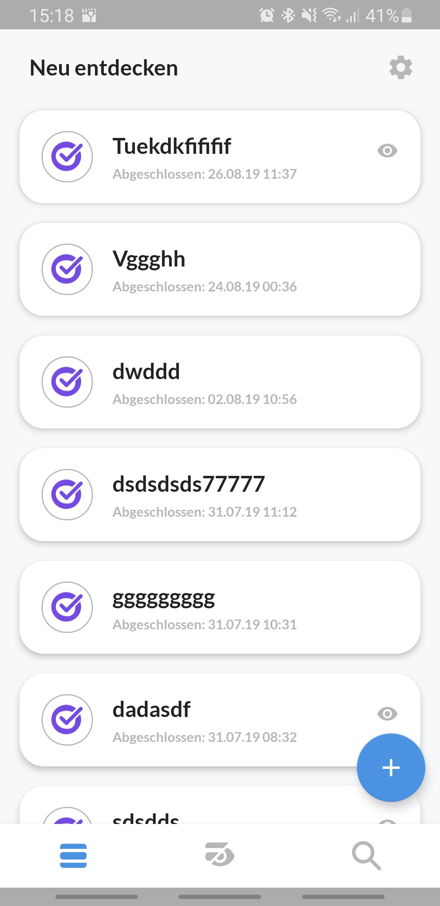
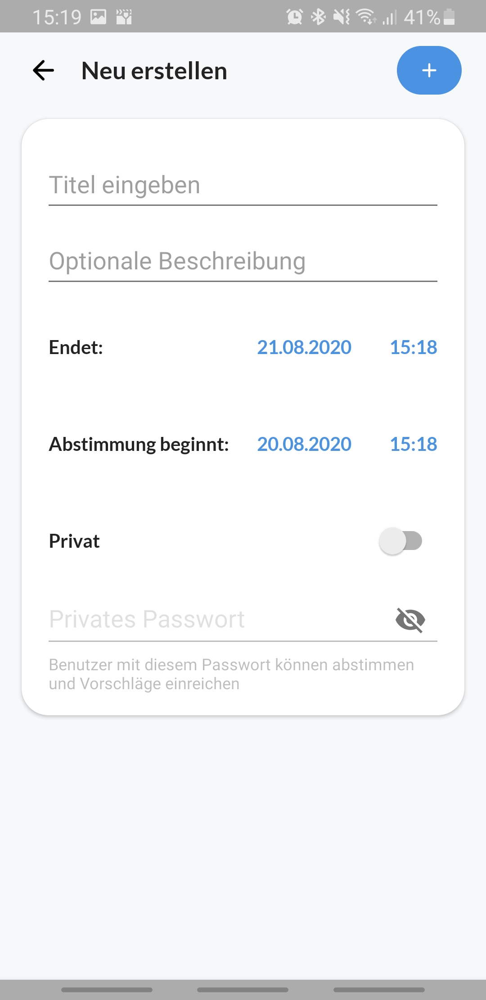
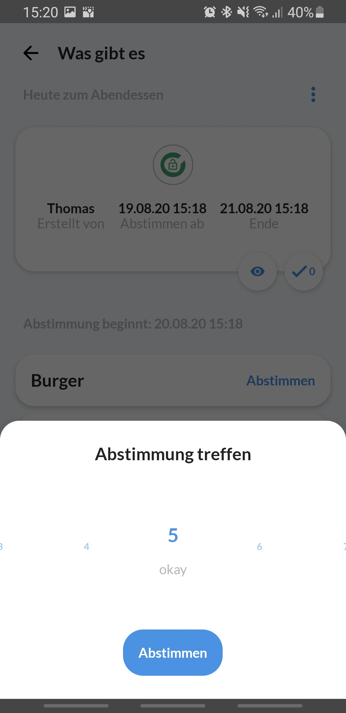
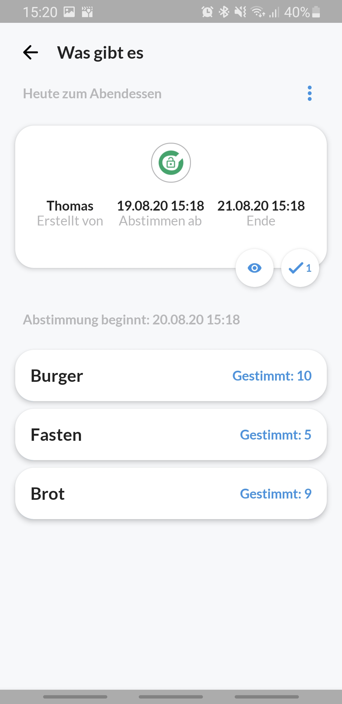

<h1 align="center">
    Rgreed App
</h1>

This apps lets users connect to the [rgreed server application](https://github.com/hothf/rgreed-server) with a user friendly interface for android where groups of people can use the technique of [technisches Konsensieren](https://www.konsensieren.eu/de/)
without the hassle of complicated UIs, tooltips and hints on how to use it.

## Screens

***
## Setup
This app is based on android "jetpack" and architecture components and uses Gradle at least 4.10.1. **Kotlin** is used as the main language of this project.

This means that at minimum **Android Studio 3.3** should be used for successful builds with a Kotlin Plugin of 1.3 and up.
***
## Architecture
To accelerate development and testability, a `Model-View-ViewModel (MVVM)` approach with android [architecture components](https://developer.android.com/jetpack/arch/) and [Databinding](https://developer.android.com/topic/libraries/data-binding/) is used. Base classes for viewModels and fragments give a structure to build upon. `LiveData<>` is used in conjunction with Databinding for updating activities and fragments with their corresponding `lifecycle`.

- To grant a reactiveness to changing data, the databinding library in this project is used for binding `viewModels` to views which will update with Lifecycle aware LiveData whenever a change has been registered. These data changes are commonly emitted via `RxJava2` through API calls or general data event subscriptions.
There **will and should be no logic in the layout .xml-files** other than lambdas and getter/setter of the bound viewModels. This keeps the layout files clean and understandable and forces to put every logic aspect into the viewModels.

- Business logic, API requests and caching will mainly be implemented in the viewModels inheriting from the `BaseViewModel` with abstractions to `Repositories`. Only certain callbacks will need activities or fragments. These callbacks are observed as queue-able `live events` by the fragments themselves and published by the viewModels. They are responsible for subscribing to these events, which is implemented in the base fragment.

- **Note** that it is a good/common practice to not put any android framework code into the viewModels at all to separate the logic from the views completely.
In this approach, viewModels are allowed to use android framework functions to gather **resources such as drawables, dimensions and translated strings**, manipulate **view states** and **start a navigation flow** simply for a nicer development experience - however, a viewModel is strictly **not allowed** to "know" the views they are updating to make them interchangeable and testable at any time.

- Items for adapters to fill `RecyclerViews` can inherit from the `BaseItemViewModel`. This is a stripped down version of a real viewModel. It can not be reused by the ViewModelProvider. This is intended as the data itself should be contained in a LiveData object containing that adapter making it lifecycle aware, in memory and removes the need of looking up every item in the ViewModelProvider when rebinding a item view.

- Use Koin for `Dependency Injection`. Every new viewModel has to be registered as a viewModel for Koin to be injected.
All other default components needed by the bare base architecture for accessing the database, API and common helpers are already injected via singleton instances.

- The api is consumed using `Retrofit` and `RxJava2`. Storing data is done with `ObjectBox`.

## Navigation
The app should consist of one activity. The single activity will handle all main navigational events to sub-fragments. This enables a very easy deep-linking and allows for global event handling such as for notifications where only the main activity displays info on top of all other views.

## Main Libraries
* Databinding library
* Android architecture components
* Jetpack navigation framework
* KTX, android kotlin-extensions
* Koin dependency injection
* Retrofit
* ObjectBox
* RX: Java, Kotlin, Android
***
## Linting

The [detekt](https://github.com/arturbosch/detekt) plugin is used for kotlin linting. Usage: `./gradlew detektCheck`

## Javadoc / KDoc

Javadoc or KDoc generation can be triggered via the [dokka](https://github.com/Kotlin/dokka) plugin. Usage: `./gradlew dokka`
***
## Contribute

Use pull requests to merge into the *stable* branch and open issues of the GitLab project to help contributing:
- We use a Git-Flow approach, naming the develop branch *stable*. Please branch from this to work on new features.
- Please make sure to add **Tests** to all new features you want to be merged into the stable branch.
